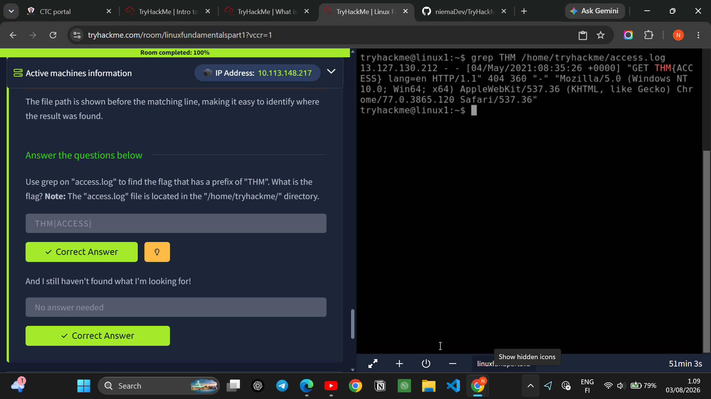
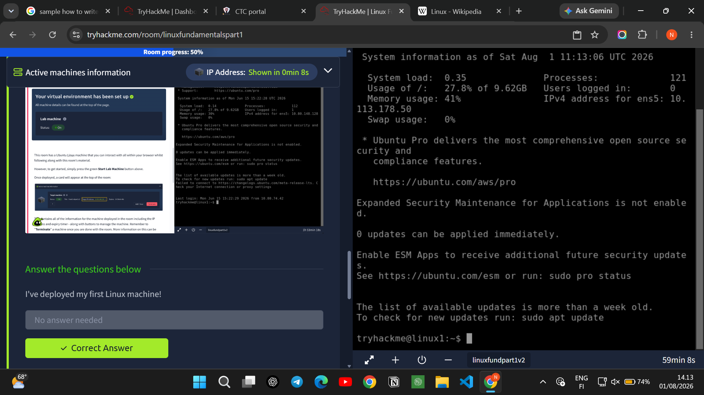
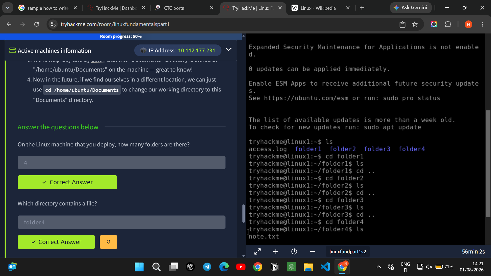
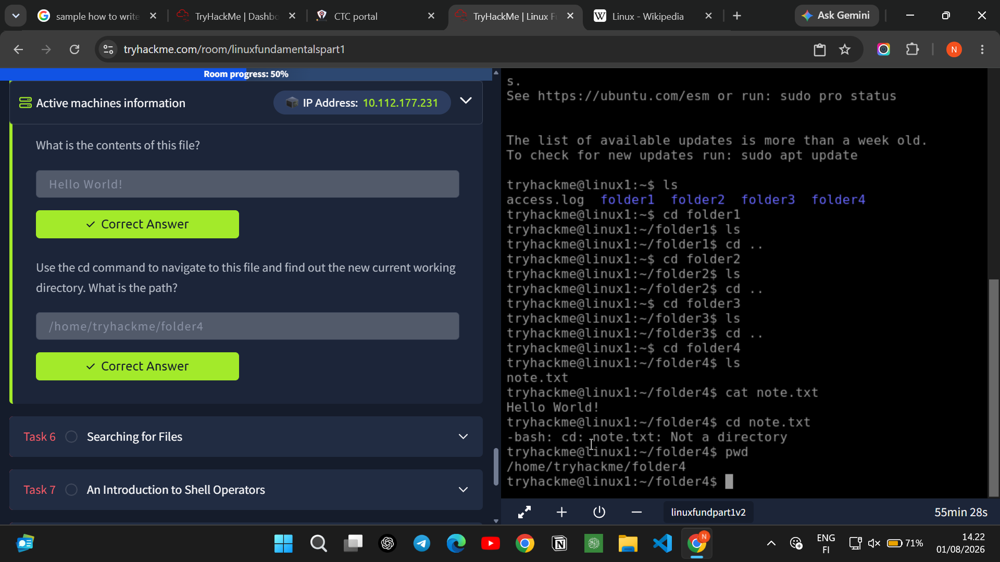
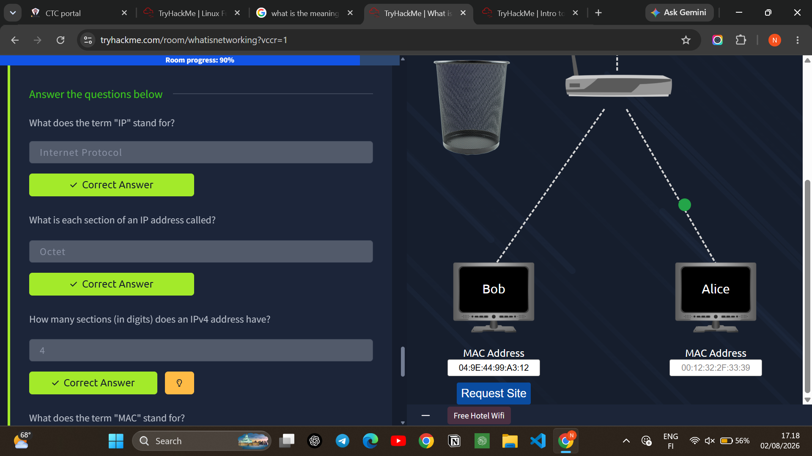
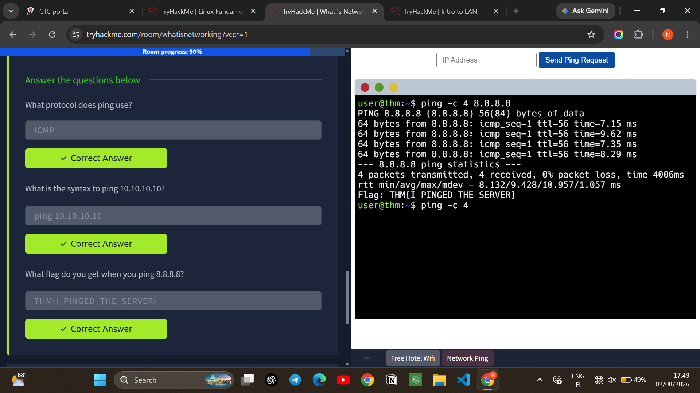
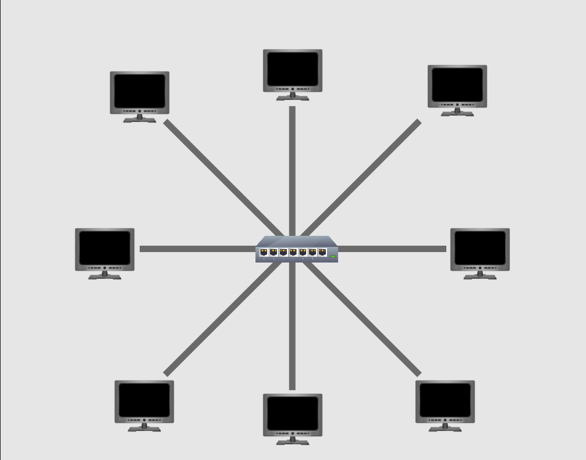
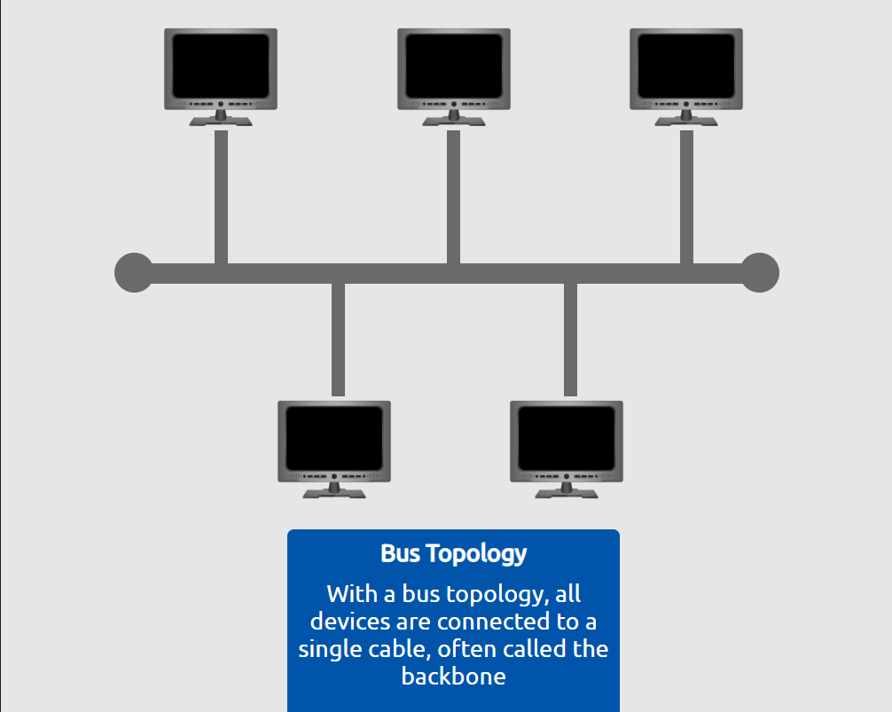
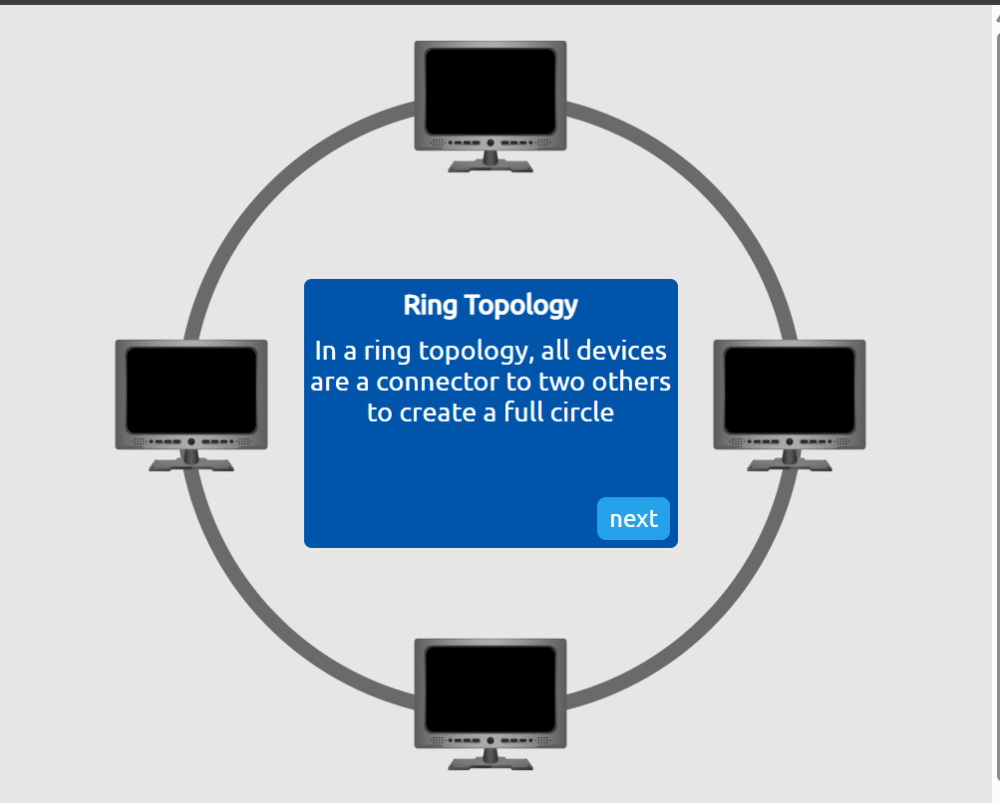
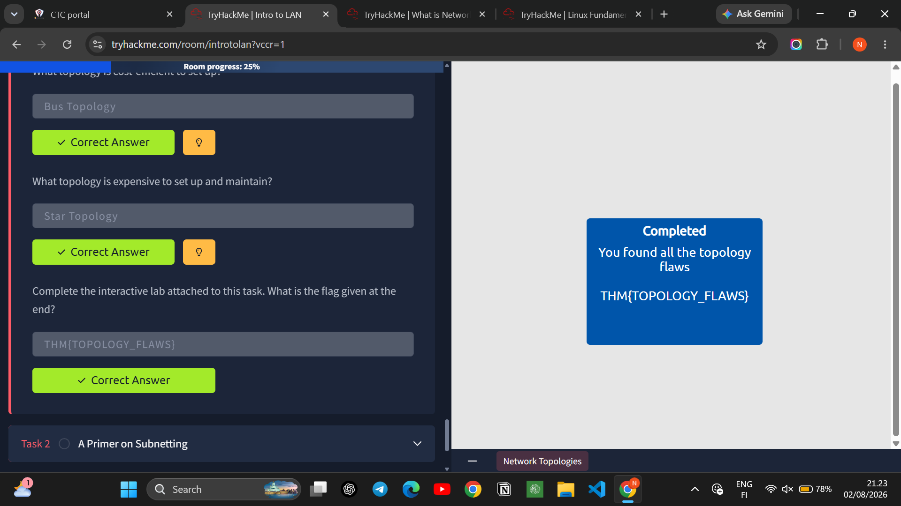

# TryHackMe Lab Write-Up
## Linux Fundamentals Part 1 | What is Networking? | Intro to LAN

**Student Name:** Nimet Eyayu Alemu  
**ID:** CTC-3382-26          

---

## Introduction

This document contains write-up for three TryHackMe rooms that I completed as part of my task as cybersecurity training at INSA Cyber talent Summer Camp 2026. I completed three TryHackMe rooms - linux Fundamentals Part 1, What is networking?, and Intro to LAN. These labs were great for beginners in cybersecurity because they contain basics of Linux and networking. I'm gonna share what I learned from each room and show some screenshots of my work.

**Why These Labs Matter**
In cybersecurity, Linux and networking are the foundation of everything. Whether you're conducting penetration tests, defending networks, or analyzing traffic, you have to understand these basics. These labs gave me hands-on experience that I can apply in real-world scenarios.

This Report contains
•	Key concepts I learned from each lab
•	Commands I actually used (with explanations)
•	Screenshots showing my work
•	Reflect  challenges that I face in the process and what I enjoyed

---

## Lab 1: Linux Fundamentals Part 1

### What I Learned

In this room i learn basic and  fundamental linux commands. First I learn about the definition of linux. Linux is a free and open source  operating system just like windows and macs. It widely used in servers, cloud computing, cybersecurity and software development. Linux isn't one operating system  it's a family built on UNIX. Because of it’s open-source, there are many versions called "distributions" or "distros".being open source give linux the biggest advantage which gives is being updated and added different feature by many developers all around the world.

Here is the main commands i learn through this room
- **Navigation commands** like `cd`, `ls`, and `pwd` - these help you move around and see what's in folders
- **Creating and managing files** with `touch` use to create empty file, `cp` use to copy a file to another location, `mv` use to move file to another directory, and `rm` use to delete files.
- **File permissions** - understanding read, write, execute and using `chmod` to change them
- **Finding stuff** with `grep` - this was actually really useful

### Commands I Actually Used to solve the lab questions

Here are some commands I practiced:

| Command | What It Does |
|---------|--------------|
| `ls` | Shows what files/folders are in current directory |
| `cd folder4` | Changes directory to folder4 |
| `pwd` | Shows where I currently am |
| `cat note.txt` | Shows what's inside a file |
| `grep THM access.log` | Searches for "THM" in the file |
| `echo TryHackMe` | Prints "TryHackMe" on screen |
| `whoami` | Shows my username |

### What I Did

First, i click start lab machine button to connect to the machine. I was at `tryhackme@linux1` which was my username.
I used `ls` and saw there were folders named folder1 to folder4 and a file called `access.log`. I explored each folder and in folder4 i found a file called `note.txt` which had "Hello World!" inside.

I also used `grep` to search for "THM" in the `access.log` file. The command was `grep THM /home/tryhackme/access.log` and I found the flag `THM{ACCESS}`. That was pretty satisfying!

I practiced `echo TryHackMe` which just displayed the text, and `whoami` which showed I was logged in as `tryhackme`. Basic stuff but good to practice.

The most useful command that i learn is the command * find* because when i try to find a specific file it becomes a headache when i have to look through every single one just to try and look for specific file. If i know the file name that i went to open. I can just use  find -name passwords.txt(name of the file) where the command will look through every folder in our current directory for that specific file. and of course i couldn't pass without mention The command *grep*. This allows us to search the contents of files for specific value that we are looking for .If we went to see all files that has a specific file extension.

Here there are operators in linux such us:
&	  This operator allows you to run commands in the background of your terminal.
&& 	This operator allows you to combine multiple commands together in one line of your terminal.
> 	 This operator is a redirector - meaning that we can take the output from a command (such as using cat to output a file)      and direct it other file.
>> 	This operator does the same function of the > operator but appends the output rather than replacing (meaning nothing is       overwritten).

### Screenshots

*Figure 1: Finding the flag using grep*

*Figure 2: Interacting with the Linux machine and using whoami*

*Figure 3: Exploring folders and finding the note.txt file*

*Figure 4: Reading note.txt and seeing "Hello World!"*

---

## Lab 2: What is Networking?

### What I Learned

In this room i learn about networking concepts. Here is what i learned:

- definition of **IP address**  - it stands for Internet Protocol and has 4 parts called octets (like 10.112.177.231)
- **MAC addresses** - these are physical addresses for devices, like `04:9E:44:99:A3:12`
- **Ping** uses ICMP protocol to check if a server is alive

### What I Learn

I learn the fundamental networking concepts. Networks are simply connected thing just like our connection to many friends .A network can be formed by anywhere from 2 devices to billions .The other fundamental concept that i learned through this room is internet. The Internet is one giant network that consists of many small networks within itself. there are two types of network private and public.
IP address uses to identify devices on a network it is just like students id if the student changes school there id also change . MAC addresses are like physical serial numbers for network cards it is like fingerprint you were born with it every device gets mac address from the manufacture when it produced. there are two types of ip address the old one ipv4 and the new ipv6.
The interesting thing with MAC addresses is that they can be faked or "spoofed" in a process known as spoofing. This spoofing occurs when a networked device pretends to identify as another using its MAC address. for preventing to happen this we need a bodyguard in this case we came across the concept of firewall. It makes sure the communication between two device are safe from other third party with a bad intention.

I also learned about ping - it's a command to check if a server is online. I pinged `8.8.8.8` (Google's DNS) and got the flag `THM{I_PINGED_THE_SERVER}`.

### Screenshots

*Figure 5: Understanding IP and MAC addresses*

*Figure 6: Using ping to check if a server is online*

---

## Lab 3: Intro to LAN

### What I Learned

In this room i learn about Local Area Networks. Here is the main content:

- **LAN** stands for Local Area Network
- **Routers** do routing (obvious, right? lol)
- **Switches** connect multiple devices on a network
- **Topologies** - bus topology is cheap but star topology is expensive
- **Subnetting** - dividing networks into smaller pieces
- **Subnet masks** have 32 bits and octets range from 0-255
- **ARP** stands for Address Resolution Protocol
- **DHCP** - devices use DHCP Discover, Request, and ACK to get IP addresses

### What I Did
In this room i learn about LAN. A LAN (Local Area Network) is a group of computers and electronic devices connected together across a small local area, such as a home network, an office building, or a school. Common examples include a home Wifi connecting your phone and smart TV, or an office network sharing a single printer.
In this section i cover 3 types of Local Area Network (LAN) Topologies. here they are:
Star Topology
It is a devices are individually connected via a central networking device such as a switch or hub.it is expensive to set up and maintain.

Bus Topology
This type of connection relies upon a single connection which is known as a backbone cable.it is just like leaf off of a tree in the sense that devices.it is cost-efficient to set up.

Ring Topology
A network setup where each device is connected to exactly two other devices, forming a circular loop.

I learned about different network topologies. Bus topology is cheaper but star topology is expensive. I did an interactive lab where I found topology flaws and got the flag `THM{TOPOLOGY_FLAWS}`.

I also learned about subnetting which is dividing networks into smaller parts it is just like slicing up a cake for your friends- super useful for security and efficiency.

I see about ARP (Address Resolution Protocol) it allows a device to associate its MAC address with an IP address on the network.

And DHCP - this is how devices get IP addresses automatically. They send a Discover packet, then Request, then get an ACK (acknowledgment).

### Screenshots

*Figure 7: Topologies and flags*

---

## Summary & Reflection

Honestly, these labs were really fun and useful! The Linux one was my nightmare before this lab but know i become familiar to it. I already knew some basic commands and practice them in kali linux but I learned new stuff like `grep` which is really useful for finding things in files.

The networking rooms helped me understand how the internet actually works. Before this, I knew what an IP address was but I didn't really understand MAC addresses or why we need both. Now I get it - IP is like your home address and MAC is like your physical house, both are needed!

The LAN room was interesting because I never really thought about how networks are set up. I didn't know there were different topologies or what subnetting was. It makes sense though - businesses need to separate their employee network from guest WiFi for security.it is all about this three rooms.

## References

- TryHackMe. (2026). *Linux Fundamentals Part 1*. https://tryhackme.com/room/linuxfundamentalspart1
- TryHackMe. (2026). *What is Networking?*. https://tryhackme.com/room/whatisnetworking
- TryHackMe. (2026). *Intro to LAN*. https://tryhackme.com/room/introtolan

---

**🔗 Repository Link:** https://github.com/niemaDev/TryHackMe-Linux-Networking-Writeup

---
